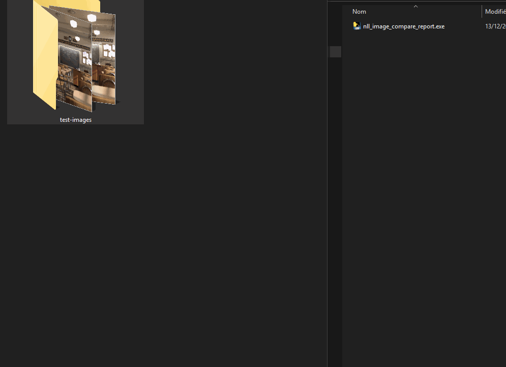

A tool for generating an HTML change report between images in a folder.

> An example report can be seen [here](https://nllsoft.com/tools/nll_image_compare_report/example_report/).

# Usage

Drop an images folder on the executable - the HTML report will be written in the folder.

Image names are used to detect the image variants, based on the `-` character.

For example, the two images :

* `my nice image - after.png`
* `my nice image - before.png`

will appear as one image `my nice image` in the report, with a slider to seen changes between `after` and `before` (alphabetical order)

Thanks to https://github.com/pehaa/beerslider for the slider code.